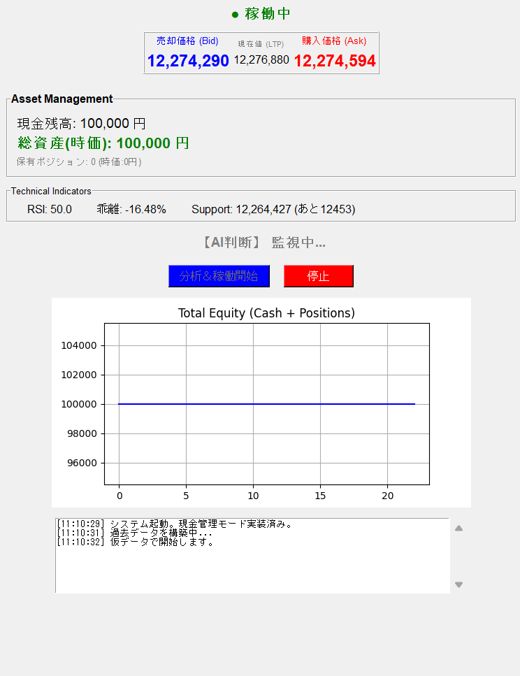

# ビットコイン自動取引システム(GMO Coin API連携 自動取引ボット)

> GMOコインのパブリックAPIを活用し、RSIやZ-Scoreなどのテクニカル指標に基づいてビットコインの自動売買（シミュレーション）を行うデスクトップアプリケーション

## Demo / Visuals



## Overview

PythonとTkinterを用いて開発した、ビットコイン（BTC）の自動取引シミュレーターです。GMOコインのAPIからリアルタイムな板情報（Bid/Ask/LTP）を取得し、内部で計算したテクニカル指標（RSI、Z-Score、サポートライン）と組み合わせて自律的な売買判断を行います。
資産推移のリアルタイムグラフ描画や、Maker手数料（マイナス手数料）を考慮した損益計算ロジックを実装しています。

## Motivation

データ分析ライブラリ（Pandas, NumPy）を用いた時系列データの処理を、静的な分析だけでなく「リアルタイムストリーミングデータ」に対して適用するアーキテクチャを設計したいと考え開発しました。また、API通信や重いデータ処理をバックグラウンドで行いながら、ユーザーインターフェース（GUI）をフリーズさせずに描画し続ける非同期処理の実装手法を学ぶ目的もありました。

## Tech Stack

* **Language:** Python
* **GUI Framework:** Tkinter
* **Data Processing & Math:** Pandas / NumPy
* **Visualization:** Matplotlib (FigureCanvasTkAggによるTkinterへの埋め込み)
* **Network & API:** `requests` (GMO Coin Public API), `yfinance` (過去データ取得)
* **Concurrency:** `threading` (メインループと取引ループの分離)

## Key Features & Technical Highlights

### 1. マルチスレッドによる非同期GUI制御
* APIポーリングやテクニカル指標の計算を行う無限ループ（`trading_loop`）と、Tkinterのメインループ（UI描画）を `threading` を用いて分離。
* 別スレッドからGUIの要素を安全に更新するため、`self.root.after()` を活用し、画面のフリーズ（ブロック）を防ぐ堅牢なアプリケーション設計を実現しました。

### 2. Pandasを用いたリアルタイムなテクニカル分析
* `yfinance` で取得した過去データと、APIから取得したリアルタイム価格をPandasのDataFrameでシームレスに結合。
* 直近の価格データに対して `.rolling()` メソッドを使用し、**RSI（相対力指数）**、**サポートライン（最安値更新）**、**Z-Scoreプロキシ（200日移動平均からの乖離率）**を毎秒計算し、AIの売買判定ロジックに組み込んでいます。

### 3. 取引所特有の「Maker手数料」を考慮した損益ロジック
* GMOコイン等の取引所で採用されているマイナス手数料（Maker報酬）の概念をコードに実装（`FEE_RATE = -0.0001`）。
* 単なる差金決済だけでなく、指値注文が約定した際に発生する手数料報酬（リベート）を含めた、現実に即した総資産（Equity）のトラッキングを行っています。

## Installation & Usage

本アプリケーションはローカル環境で実行可能なデスクトップアプリです。

### 実行環境のセットアップ
```bash
# リポジトリのクローン
git clone [https://github.com/your-username/btc-trading-bot.git](https://github.com/your-username/btc-trading-bot.git)
cd btc-trading-bot

# 必要なライブラリのインストール
pip install pandas numpy matplotlib requests yfinance
